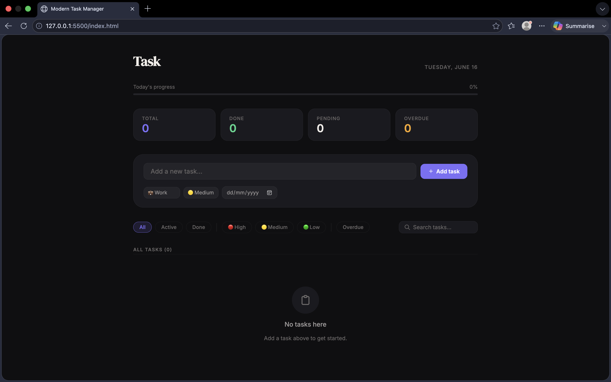
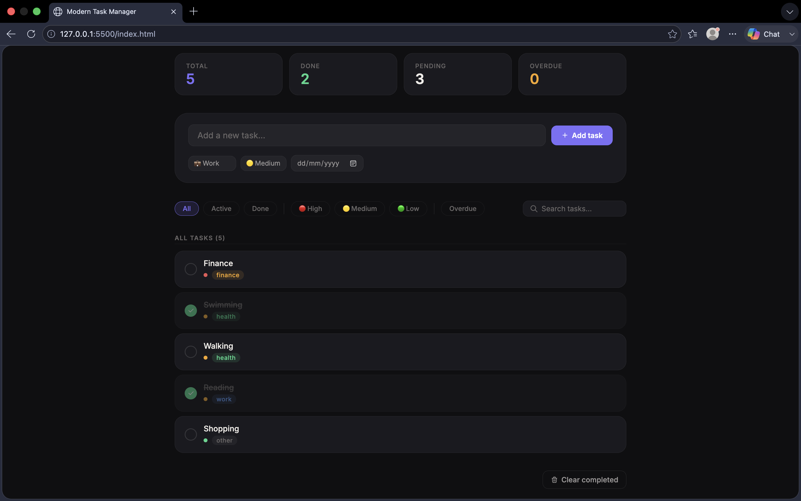

# 📋 Modern Task Manager

A clean and responsive task management web application built using **HTML**, **CSS**, and **JavaScript**. It helps users organize daily activities, prioritize tasks, track progress, and improve productivity through an intuitive interface.

---

## ✨ Features

- ✅ Add new tasks instantly
- ✏️ Edit existing tasks
- 🗑️ Delete unwanted tasks
- ✔️ Mark tasks as completed
- 📅 Assign due dates to tasks
- 🔴🟡🟢 Set task priorities (High, Medium, Low)
- 📂 Categorize tasks (Work, Personal, Health, Finance, Other)
- 🔍 Search tasks by name
- 🎯 Filter tasks based on status and priority
- 📊 View real-time progress statistics
- 💾 Data persistence using **Local Storage**
- 📱 Fully responsive design for desktop and mobile devices

---

## 🛠️ Technologies Used

| Technology | Purpose |
|------------|-----------|
| **HTML5** | Structure of the application |
| **CSS3** | Styling and responsive layout |
| **JavaScript (ES6)** | Application logic and interactivity |
| **Local Storage API** | Saving tasks permanently in the browser |
| **Tabler Icons** | Modern user interface icons |
| **Google Fonts** | Enhanced typography |

---

## 📂 Project Structure

```text
modern-task-manager/
│
├── index.html
├── style.css
├── script.js
├── README.md
│
└── screenshots/
    ├── homepage.png
    ├── add-task.png
    └── task-list.png
```

---

## 🚀 Getting Started

### 1. Clone the Repository

```bash
git clone https://github.com/your-username/modern-task-manager.git
```

### 2. Open the Project Folder

```bash
cd modern-task-manager
```

### 3. Run the Application

Simply open the **index.html** file in your web browser.

No installation or additional dependencies are required.

---

## 📸 Screenshots





---

## 🎯 Learning Outcomes

Through this project, I gained practical experience in:

- DOM Manipulation
- Event Handling
- Array Methods in JavaScript
- Local Storage Management
- Responsive Web Design
- Building Interactive User Interfaces
- Organizing code for maintainability

---

## 🔮 Future Improvements

- [ ] Dark Mode support
- [ ] Drag and Drop task sorting
- [ ] Task reminders and notifications
- [ ] Export tasks as PDF or CSV
- [ ] User authentication and cloud sync
- [ ] Dashboard analytics

---

## 💡 How It Works

1. Enter a task title.
2. Choose a category, priority level, and due date.
3. Click **Add Task**.
4. Manage tasks by editing, completing, searching, or deleting them.
5. Track overall productivity using the progress bar and statistics section.

---

## 📜 License

This project is created for **educational and internship purposes**.

Feel free to use and modify it for learning.

---

## 👨‍💻 Author

**Name:** GUDDU KUMAR  
**Intern ID:** CTTS108